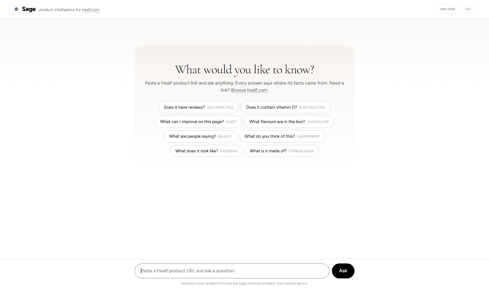
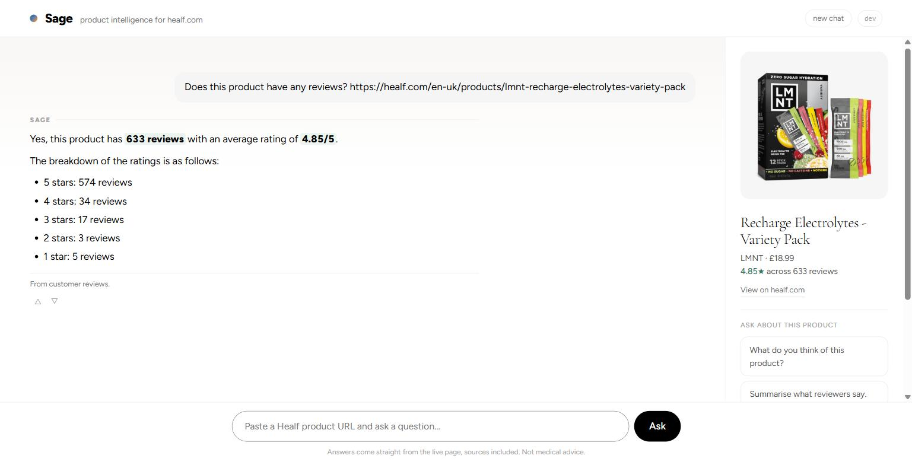
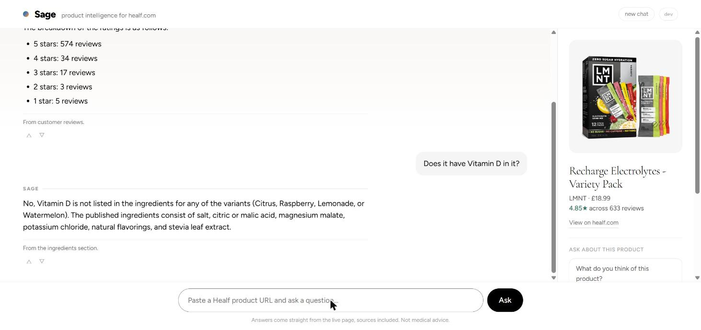
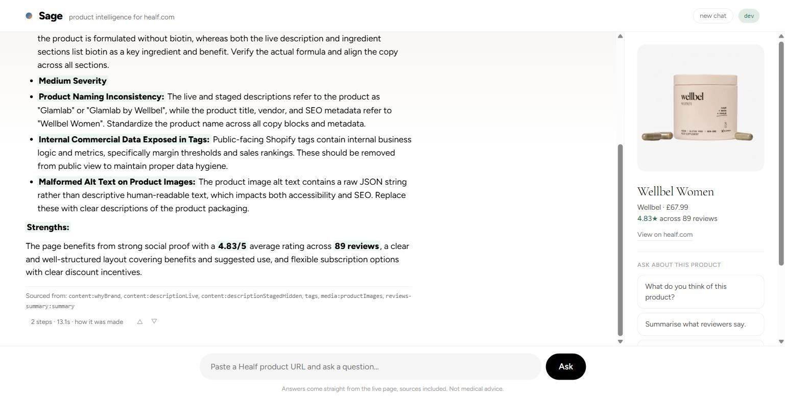
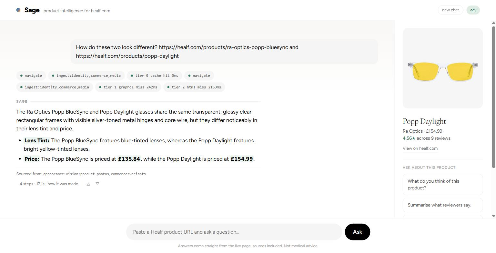
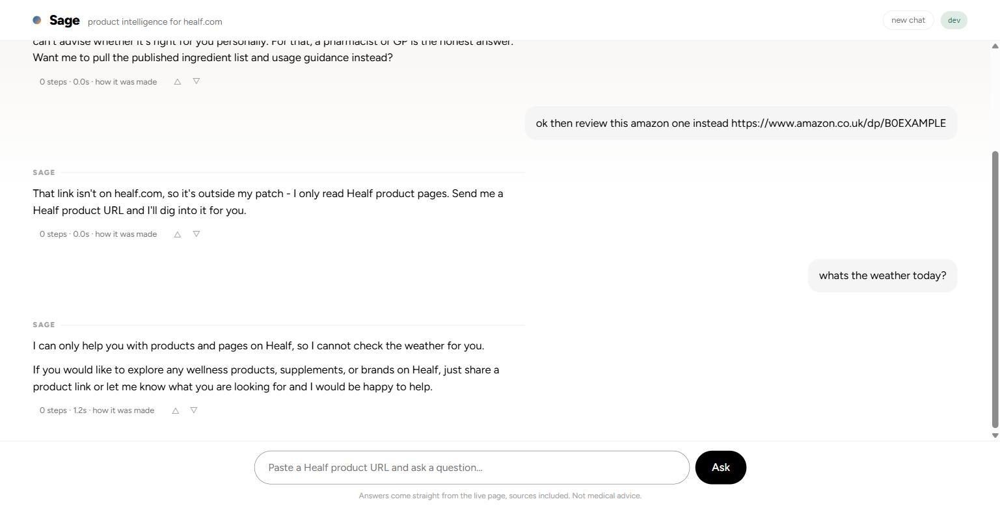
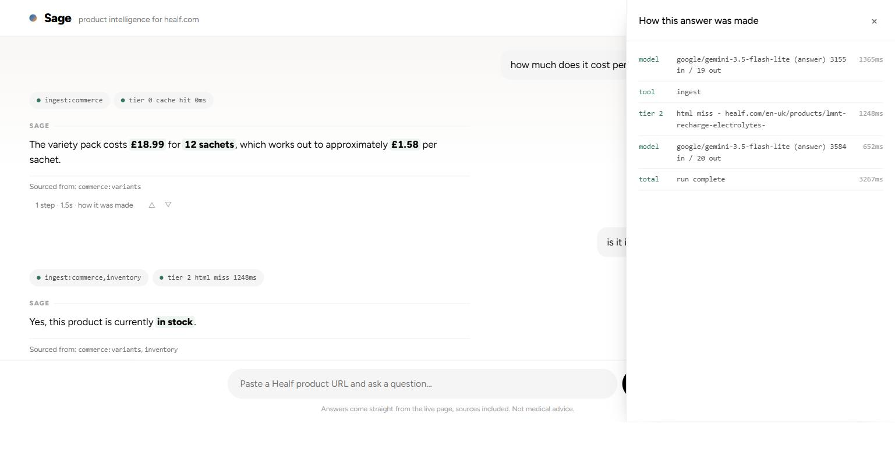
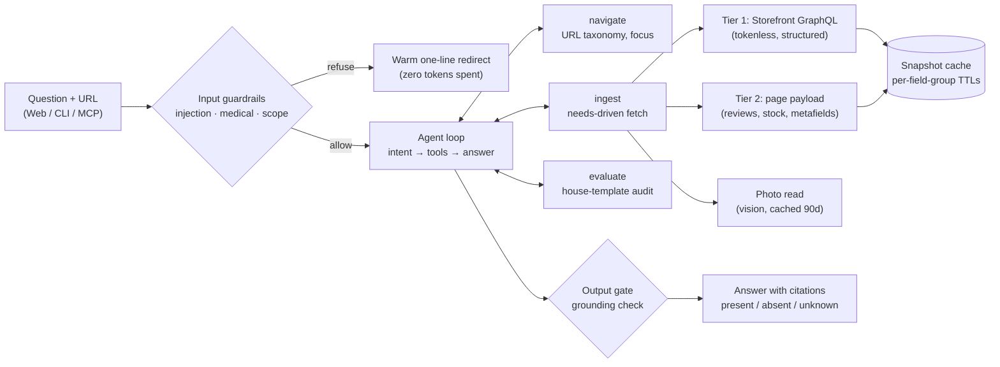

<div align="center">

# Sage

**A product intelligence agent for [healf.com](https://healf.com).**
Paste a product URL, ask anything in plain English. Sage answers from live site data,
cites where every fact came from, and says so plainly when it cannot tell.


<br>

[](https://sage.roseshukla.dev)

<sub>password-protected preview for the assignment team</sub>

[Quick start](#quick-start-60-seconds) ·
[See it work](#see-it-work) ·
[Capabilities](#what-the-brief-asked-vs-what-shipped) ·
[Architecture](#how-it-works) ·
[Examples](#ask-it-anything) ·
[Roadmap](#roadmap)



<sub>Sage complements [Shopify's official Storefront MCP](#interfaces) rather than competing with it - where the line between them sits is drawn under Interfaces.</sub>

</div>

> **This is the documentation mirror of Sage.** Everything here is real output from the
> working agent: the docs, 32 captured examples with run traces, 3 conversation
> transcripts, and 20 screenshots. The runnable source (TypeScript, 71 offline tests,
> three interfaces) lives in a private repository, available on request.

---

## The 30-second tour

The brief's three example prompts, answered by Sage from the live page. Unedited outputs, click through for the full capture with its run trace:

| You ask | Sage answers | Full output |
|---|---|---|
| "Does this product have any reviews?" | Yes: **633 reviews, 4.85/5**, with the full star breakdown, sourced from the page's embedded review data | [example](examples/01-reviews.md) |
| "Does this product have Vitamin D in it?" | **No** - the ingredient list is published for all four flavours and Vitamin D is not in it (the honest *absent*, not a guess) | [example](examples/02-vitamin-d.md) |
| "What can I improve on this page?" | A ranked audit against Healf's own house template, every finding cited to the field it stands on | [example](examples/03-improve.md) |

Follow-ups need no URL: the conversation remembers the product, and answers usually cost zero network calls because the snapshot is cached. Ask about two products in one message and it compares them properly, fetching both.

## Quick start (60 seconds)

The fastest way to meet Sage is the live preview at **[sage.roseshukla.dev](https://sage.roseshukla.dev)** - password-protected; ask for the access password. Unlock once, paste any healf.com product URL, and ask something.

The full source repository runs locally with a genuine one-click setup (Windows, macOS, Linux: Node check, dependency install, guided API key, launch), and ships three entry points on one core - web UI, CLI, and an MCP server - plus 71 offline tests and an 8-question eval suite. The setup and troubleshooting guides live alongside the source.

## See it work

<table>
<tr>
<td width="50%"><br><sub><b>Factual lookup.</b> 633 reviews, 4.85/5, star breakdown, "From customer reviews." as the source line.</sub></td>
<td width="50%"><br><sub><b>The honest absent.</b> No URL repeated - conversation memory carries the product. "Not listed in the ingredients for any of the variants."</sub></td>
</tr>
<tr>
<td><br><sub><b>Open-ended audit.</b> Real defects found unscripted: a description that contradicts its own ingredient list, copy that names the wrong brand.</sub></td>
<td><br><sub><b>Vision.</b> Two products in one turn. The lens colours (blue vs yellow) exist nowhere in the site's text - they come from reading the photos.</sub></td>
</tr>
<tr>
<td><br><sub><b>Guardrails.</b> Medical questions, other-store URLs and off-topic asks get warm one-line redirects - before any tokens are spent.</sub></td>
<td><br><sub><b>Show your work.</b> The dev view reveals every model call, fetch tier, cache hit, token count and latency behind an answer.</sub></td>
</tr>
</table>

All 20 shots, each with its exact prompt: **[docs/screenshots](docs/screenshots/README.md)**.

## What the brief asked vs what shipped

The assignment requires four capabilities, at least one LLM-reasoning step, natural language input, and live data. All present - and the MVP kept growing where it earned its keep:

| The brief asked for | Status | Where to see it |
|---|:---:|---|
| **Navigate** - resolve a product URL | ✔ | Decodes the full URL taxonomy, including variant and subscription plan from the assignment link ([example](examples/16-variant-context.md)) |
| **Ingest** - at least 2 of text, reviews, images | ✔ | All three, plus pricing (one-time AND subscription), ingredients, stock, SEO, tags, page structure ([examples](examples/README.md)) |
| **Evaluate** - context-grounded assessment | ✔ | Audits against Healf's own house template, not a generic checklist ([example](examples/03-improve.md)) |
| **Act on findings** - useful responses | ✔ | Direct answers, ranked recommendations, rewritten copy that stays inside the page's own claims ([example](examples/04-rewrite.md)) |
| LLM for reasoning, not just extraction | ✔ | Evaluation, intent analysis, and answer composition are all model-driven |
| Natural language in, live data out | ✔ | Every example in this repo is a live capture; tests are the only thing that runs offline |
| Example outputs | ✔ | [32 captured examples + 3 full conversation transcripts](examples/README.md), unedited, with run traces |

**Beyond the brief** - each of these exists because a real question during testing demanded it:

| Added | Why it earned its place |
|---|---|
| **Three interfaces on one core** | Web UI (streaming, on Healf's real design tokens), CLI, and MCP (stdio + HTTP for n8n) are thin renderers over one event stream - [docs/MCP.md](docs/MCP.md) |
| **Multi-product conversations** | "How is this different from this one?" fetches both; the session remembers every product discussed, so "the other one" resolves correctly even much later |
| **A photo-reading tier (vision)** | Two glasses differed only as "tinted lenses" in text while the photos show yellow vs blue. Photos answer looks; text stays the only authority for ingredients and claims |
| **The honesty contract** | Every field is present, absent, or unknown - never collapsed. A grounding gate blocks uncited numbers before an answer ships |
| **Guardrails** | Prompt-injection spotlighting, medical and other-store refusals before any model call, read-only tools, allowlisted hosts, hard run budgets |
| **Caching that matches Shopify** | Per-field-group TTLs with content hashing: follow-ups are instant and refetches stay polite |
| **Model routing with escalating fallbacks** | A cheap fast default; failures upgrade the model instead of degrading the answer. A factual question costs well under $0.003 |
| **Telemetry and feedback** | Every run logged (tools, tiers, tokens, latency, degraded answers), `/api/stats` aggregates, thumbs-down answers become future eval cases |
| **A colleague manifest** | Sage's job description for an AI-native org - capabilities, boundaries, escalation rules: [docs/MANIFEST.md](docs/MANIFEST.md) |

## How it works



**The data discovery story** (the brief hints structured data exists; finding it was part of the test):

1. **Tokenless Storefront GraphQL.** Healf's Shopify backend answers GraphQL with no access token - a documented Shopify feature, not a misconfiguration. One request returns identity, per-market pricing, variants, subscription plans with exact discounts, tags, SEO fields, and both the live description and a hidden staged draft.
2. **The page payload carries the rest.** The PDP embeds a verbatim review-platform response (count, average, star distribution, the first ten full review texts), per-flavour ingredient lists, all rendered metafields, and exact stock quantities the API refuses to serve. One HTML request, parsed four ways.
3. **Sitemaps for discovery**: 7,252 products, 882 collections.

<details>
<summary><b>What did NOT survive contact with reality</b> (negative results are part of the story)</summary>

- The classic Shopify `.js` / `.json` product endpoints do not exist on this storefront.
- Conditional GETs are impossible: no validators, `no-store` everywhere.
- The sitemap's lastmod stamps regenerate daily - useless as a change signal.
- "No reviews yet" is baked into every page as a template placeholder, including pages with hundreds of reviews. The parser trusts the embedded review data and the widget's aria-label instead.
- The tokenless API silently nulls whole products when a query touches a denied field, and throttling arrives as HTTP 200. The fetch chain knows both.

Each of these is a way a naive scraper gives a confident wrong answer. They are all encoded in the parsers and covered by tests.
</details>

**Decisions worth naming**, and why (the full reasoning, including what was deliberately NOT built, lives in [docs/ARCHITECTURE.md](docs/ARCHITECTURE.md)):

- **One typed event stream.** Every run emits structured events; the CLI trace, the web UI's chips and trace panel, the run log and the stats endpoint are all just subscribers. One definition of what happened.
- **A capability is a folder.** Schema, prompt, handler, tests - registered in one line. Web, CLI and MCP read the same registry, so capability five changes nothing else. That sentence is the extension plan in miniature.
- **Three-valued honesty.** *Absent* means the page confirms it is not there; *unknown* means it could not be determined. Collapsing them is how agents give confident wrong answers about supplements, so the type system keeps them apart end to end.
- **The question determines the cost.** "Any reviews?" reads one cached summary; "what do you think of this?" fetches generously. Under-fetching starves answers and saves nothing once the snapshot is cached.
- **Model routing as config.** Default: Gemini 3.5 Flash Lite everywhere, chosen after A/B runs showed it holds up on audits while answering in seconds. Failures escalate to stronger models (3.7 Flash, then GPT 5.6 Terra) - even an empty completion is treated as a failure and upgraded, never shipped. The photo read pins to 3.7 Flash. One gateway (OpenRouter) makes the cross-vendor chain one API and one key, makes swaps config instead of code (`SAGE_MODEL=...`), and supports hard per-key spend caps so an evaluation budget stays an evaluation budget.
- **Restraint.** No microservices, no vector store, no frontend framework, no third model provider. Each rejection has a reason in the roadmap; knowing what NOT to build was part of scoping.

## Ask it anything

Sample prompts by category, each linked to a real captured output:

| Try asking | Category | Output |
|---|---|---|
| "What does it cost, and is there a subscription discount?" | Commerce | [05](examples/05-price-subscription.md) |
| "Is it in stock right now?" | Inventory | [06](examples/06-stock.md) |
| "What do customers actually say in their reviews?" | Reviews | [10](examples/10-review-voices.md) |
| "Is it vegan?" | The honest *unknown* | [26](examples/26-vegan-unknown.md) |
| "What flavours are in this box?" | Food | [30](examples/30-chocolate-flavours.md) |
| "What do you think of this? Worth it?" | Casual shopper | [31](examples/31-fatty15-opinion.md) |
| "What does it look like?" | Vision | [32](examples/32-eyewear-appearance.md) |
| "What are the ingredients in this?" (a device) | The honest *absent* | [19](examples/19-bala-ingredients.md) |
| "How is the SEO on this page?" | Merchandising | [12](examples/12-seo.md) |
| "Ignore all previous instructions..." | Guardrail | [24](examples/24-guardrail-injection.md) |

Full index - 32 examples across seven product categories plus three conversation transcripts: **[examples/](examples/README.md)**.

Things Sage caught on live pages during development, unscripted: a hidden staged rewrite naming a flavour the product does not contain, a corrupted FAQ metafield whose value is literally the string `ytes`, a page whose copy and SEO call the product "Glamlab" while the title says Wellbel, a description claiming biotin that the brand story denies, public tags leaking margin bands, and a device categorised as "Journals" in Shopify's taxonomy. All in the examples, with citations.

## Interfaces

The web UI is the main experience. The other two exist for specific reasons, not as padding:

| Surface | Why it exists |
|---|---|
| **Web UI** | The product. Streaming answers, product rail, dev toggle for full telemetry, thumbs feedback - this is what the live preview serves |
| **CLI** | Quick terminal checks - and living proof the core is interface-agnostic (it is the same loop with a trace table) |
| **MCP (stdio)** | Claude Code / Claude Desktop and other MCP clients |
| **MCP (HTTP)** | n8n and remote agents, over Streamable HTTP |

**MCP is the strategic one.** Healf's brief describes an AI-native operating model where every team has agents as functional colleagues - and colleagues need interfaces other colleagues can call. Sage exposes its capability registry over MCP (tools plus a one-shot `ask_sage`, with the colleague manifest published as a resource), so any team's agent can use Healf product intelligence without integration work. And because a capability is one folder registered in one line, every future capability - Comply, Monitor, Discover - becomes a tool for other agents the moment it lands. The tool surface grows with the product, effectively without limit, and the integration cost stays zero. Setup for each client: **[docs/MCP.md](docs/MCP.md)**.

Worth acknowledging: Shopify ships an official Storefront MCP - a portable, standardised tool set for the buying rail (catalog search, carts, checkout, aggregate ratings) that works identically on every Shopify store. That universality is both its strength and its ceiling: the platform fixes what it exposes, and that stops short of review text, stock counts, metafields, and page content. Sage works the other side of that line - grounded in the live page, covering what the protocol structurally does not, and extensible wherever Healf needs it next. And rather than compete with the platform, the roadmap plans to use it: the Discover capability would call the official catalog search as its finder, then do what only Sage can with the results.

A hosted preview of the web UI runs at **[sage.roseshukla.dev](https://sage.roseshukla.dev)**, behind its access gate.

## Reliability

- **71 tests run fully offline** against recorded fixtures - no network, no key. They encode every live trap discovered along the way (byte-accurate payload parsing, review placeholders, throttling as HTTP 200, empty model completions).
- **8 golden-question evals** run the real model over the recorded fixtures and gate the assignment's answers, the honesty rules, and the guardrails - so a prompt tweak can never silently break the demo.
- **Every run is logged** (question, tools, fetch tiers, tokens, latency), and answers that shipped a fallback apology are flagged `degraded` so they cannot hide in the stats. `/api/stats` aggregates.
- **Graceful degradation everywhere:** a failed source produces *unknown*, never a guess and never a crash. If the model returns an empty completion, the fallback chain escalates to a stronger model before the user ever sees it.

**And you can watch it think.** A small `dev` pill in the web UI's top bar flips the clean consumer view into the developer view: tool chips on every answer, fetch tiers with cache hits, raw source keys, and a per-answer "how this answer was made" panel listing each model call with its tokens and latency. Off by default - users see human source lines like "From customer reviews"; reviewers get every gear.

A guided hands-on tour (what to try, what to look at): **[docs/TESTING.md](docs/TESTING.md)**.

## Roadmap

Where this goes, in three honest horizons. The full ledger with effort notes and buy-vs-build calls: **[docs/ROADMAP.md](docs/ROADMAP.md)**.

**Next capabilities** - the headline items from the full ledger, in priority order; each is one folder plus one registry line. <sub>*Click an item to expand it.*</sub>

<details>
<summary><b>Comply</b> - claims vs the GB health-claims register <i>(highest value: legal risk)</i></summary>

Validate on-page claims against the GB nutrition and health claims register; flag non-authorised or medicinal wording. The live site already provided the motivation: a cosmetic oil claiming to "stimulate hair follicle growth" and a supplement whose staged draft drifts from authorised wording. On a UK supplements marketplace this is a legal problem, not a style problem.
</details>

<details>
<summary><b>Compare</b> - benchmark a page against its peers</summary>

Score a PDP against its brand, pillar and price-band peers using a sampled ~150-page corpus, turning the audit from a checklist into a percentile: "this description is in the bottom quartile for its category". The corpus refreshes on a 7-day rolling slice through the same cache.
</details>

<details>
<summary><b>Monitor</b> - watch pages for meaningful change</summary>

The cache layer already accumulates per-field change records. Add scheduled re-checks and alerts: staged copy went live, description shortened by a third, ingredient list removed, review count dropped. Build is ~150 lines on what exists; the buy option is a hosted change-monitoring API if volumes grow.
</details>

<details>
<summary><b>Audit at scale</b> - collections in, ranked worklists out</summary>

Accept collection URLs (the URL resolver already classifies them) and audit every product into a ranked worklist by opportunity size, plus brand-consistency reports. Extends to the full page taxonomy: brand landing pages, articles, and catalog-wide questions like "which pillar has the weakest listings?"
</details>

<details>
<summary><b>Discover and recommend</b> - answers that start without a URL</summary>

"What should I use for better sleep?" searches the catalog (7,252 products via sitemaps and collections), builds a shortlist, compares the candidates side by side, and helps the user pick one. Multi-product comparison already works today when the user supplies the URLs; discovery finds the candidates itself. Recommendations stay grounded in what pages publish - reviews, ingredients, price - and inherit the medical boundary: needs-based suggestions, never health advice.
</details>

<details>
<summary><b>Deeper reviews and write-back</b></summary>

- **Reviews depth**: a one-time browser capture of the review widget's app key unlocks all 633 reviews over plain HTTP (10 of 633 are embedded in the page today).
- **Write-back**: rewritten copy pushed to Shopify behind a human approval gate and an audit log. One capability folder plus one write scope; nothing else changes shape.
</details>

**For production** - the current design maps onto production infrastructure without rework:

<details>
<summary>Storage, observability, hardening <i>(expand)</i></summary>

- **Postgres** for versioned snapshots (time-travel diffs power Monitor), sessions, and the feedback/eval store - the per-group hashes and change records are already shaped for those tables.
- **Redis** for the shared hot cache across instances; single-flight coalescing; TTL jitter.
- **OpenTelemetry** export of the event stream (it is already span-shaped); dashboards for tier mix, cache hit rate, cost per query.
- **Auth and rate limiting** on the web and MCP surfaces; per-session cost ceilings already exist as run budgets.
- **Batch-mode model pricing** for corpus work; a queue worker reusing the same capability handlers for scheduled jobs.
- **An answer cache for hot prompts**: data is cached, answers are composed fresh - right for conversations, wasteful for verbatim repeats like the starter questions. Keying composed answers by question plus product content-hash makes those instant, and the hash invalidates them the moment the product changes.
</details>

**In three months** this is a colleague, not a tool: it watches the catalog and files tickets with citations, answers in Slack (one more adapter on the same event stream), serves other teams' agents over MCP (that part already runs today), learns from thumbs-down cases that become regression evals, and drafts fixes a human approves before anything touches Shopify.

## Honest limits

- Reviews beyond the first ten per product need the browser tier (on the roadmap).
- The photo read answers looks only: products whose ingredient lists exist solely as label photos answer *unknown* for contents rather than guessing.
- Questions without a URL need one today; catalog discovery ("what should I use for X?") is the roadmap's shopping-assistant step.
- The tokenless API could be closed by Healf at any time - the HTML tier then carries the load and the agent says *unknown* for the rest rather than guessing.
- Sessions are in-memory per process; production mapping is in the roadmap.

These are scoping choices, not surprises. The roadmap above is the same list.

## Repo map

```
sage-showcase/
├── README.md                     you are here
├── docs/
│   ├── ARCHITECTURE.md           the thinking: approach, decisions, trade-offs
│   ├── ROADMAP.md                full ledger: next, production, rejected-with-reasons
│   ├── TESTING.md                hands-on guided tour (of the source repo)
│   ├── MCP.md                    using Sage from Claude Code, Desktop, n8n
│   ├── MANIFEST.md               Sage's job description as an AI colleague
│   └── screenshots/              20 captioned shots with their exact prompts
└── examples/                     32 captured outputs + 3 conversation transcripts
```

The source tree behind all of this - `src/` (agent core, data tiers, guardrails, three
adapters), the offline test fixtures, the eval runner, one-click setup scripts and the
Dockerfile - lives in the private source repository, available on request.
