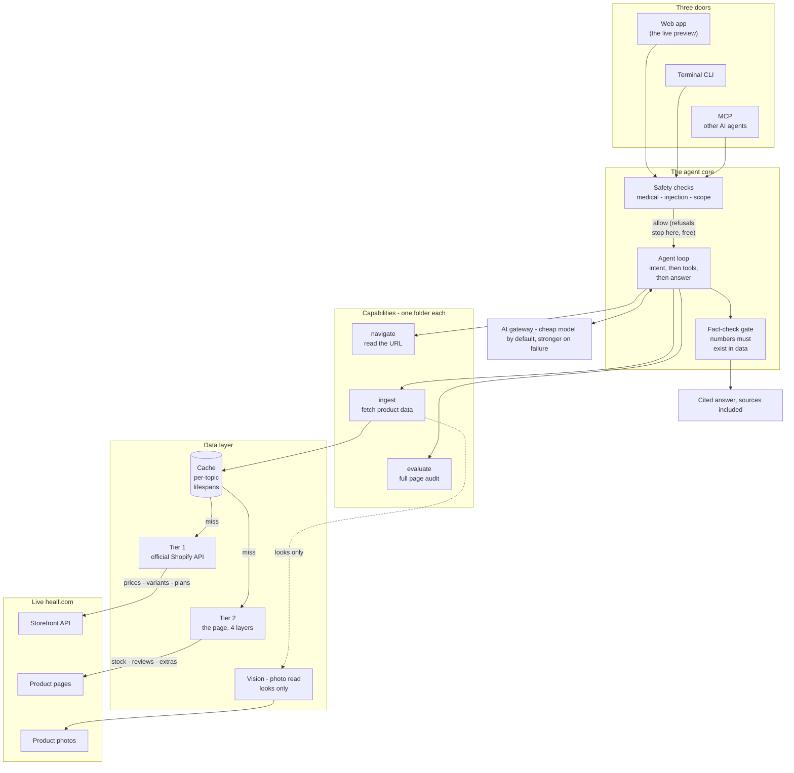
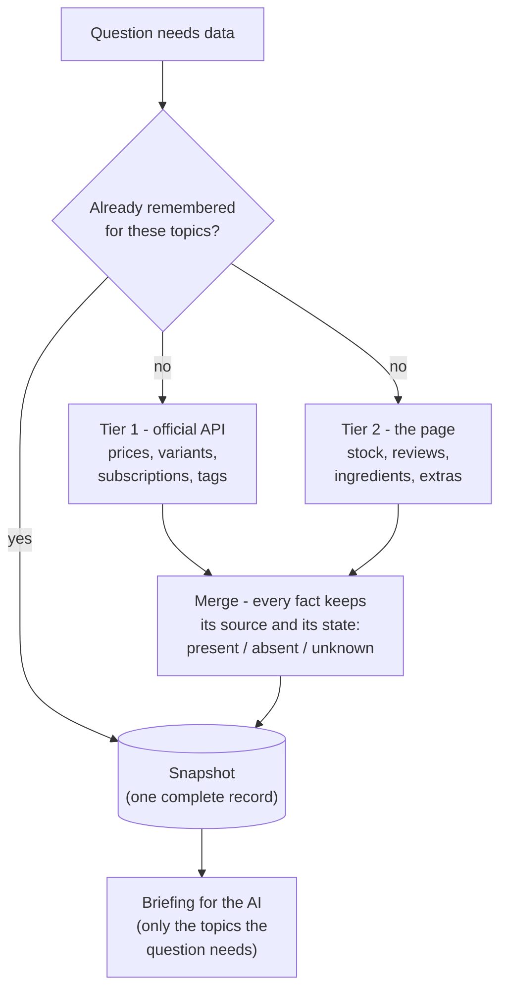
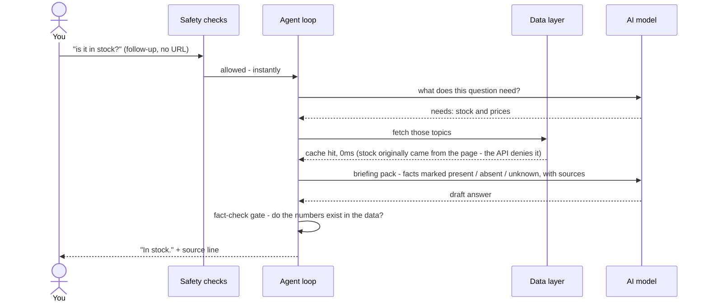

# Architecture

How Sage is put together, and more importantly, why. This is the thinking behind the
code: what I checked before building, the decisions that shaped the design, and the
things I deliberately refused to build.

**Contents:** [The idea in one minute](#the-idea-in-one-minute) ·
[Verify first, build second](#the-approach-verify-first-build-second) ·
[The data layer](#the-data-layer-where-answers-come-from) ·
[The agent loop](#the-agent-loop-what-happens-to-a-question) ·
[Honesty](#honesty-as-a-type-system) · [Guardrails](#guardrails-why-and-where) ·
[Model routing](#model-routing-cheap-by-default-stronger-on-failure) ·
[Interfaces](#one-core-three-doors) ·
[What I refused to build](#what-i-refused-to-build)

---

## The idea in one minute

Sage answers questions about Healf product pages. To do that reliably it needs three
things: **good data** (fetched from the live site, from the most structured source
available), **an honest memory of that data** (every fact marked as present, absent,
or unknown - never guessed), and **a careful way of answering** (an AI model that is
given only the relevant data, then fact-checked against it before the answer ships).
Everything below is one of those three things, done properly.

The whole system on one screen - each box is explained in its own section below:

## The approach: verify first, build second

The brief said structured data exists beyond the rendered page and that discovering it
is part of the test. So the first hours went into probing the live site, not writing
code. Every assumption was tested before anything depended on it - and several
"obvious" facts died on contact:

| What you'd assume | What the live site actually does |
|---|---|
| Shopify stores expose quick data shortcuts: add `.js` or `.json` to a product URL and raw data comes back (works on most Shopify stores) | Disabled on this storefront - those URLs return nothing useful |
| The sitemap (the site's machine-readable table of contents) tells you when a page last changed | Its "last modified" dates regenerate every day - decorative, useless as a change signal |
| If a page says "No reviews yet", the product has no reviews | That text is baked into every page as a leftover template placeholder - including a product with 633 reviews |
| Shopify's official product API needs an access token (a password for programs) | This store answers full product queries with no token at all - a documented Shopify feature most people don't know |
| Reading actual review texts requires the review platform's separate API | The first ten full reviews are embedded word-for-word inside the page itself |

That right-hand column is the foundation the whole agent stands on. Building on
verified ground instead of documentation-flavoured guesses is why the answers are
right - and each dead end matters as much as each discovery, because every one of them
is a way a naive scraper would answer wrongly with full confidence.

The same rule carried into development. When an answer looked wrong (a chocolate box
"with 4 flavours" that actually has 10), the fix started with fetching the live page
and finding the exact point where extraction diverged from reality - never with
tweaking the AI's instructions to paper over a data bug. Every such incident is now
frozen as an automated test so it can never quietly return.

## The data layer: where answers come from

A product Sage has never seen costs exactly two requests, fired at the same time:

**Tier 1 - Shopify's official Storefront API.** The structured front door. One query
returns the product's identity, prices per country (the same product is £18.99 in the
UK and €21.99 in Germany), every variant, subscription plans with their exact
discounts, tags, category, SEO fields - and even a hidden draft description that never
appears on the page. Two quirks are handled in code: ask for one field this store
denies and the API silently blanks the *entire product*, and "slow down" arrives
disguised as a success response rather than an error.

**Tier 2 - the page itself, parsed four ways.** Modern sites ship their data inside
the page in machine-readable form, chopped into pieces. Sage reassembles those pieces
(they are measured in bytes, not characters, and split mid-word across chunks - the
hardest code in the repo, and heavily tested because getting it wrong once caused
three different kinds of wrong answers). Out falls what the API refuses to share:
**exact stock counts**, per-flavour ingredient lists, brand FAQ content, and a
word-for-word copy of the review platform's data - count, star spread, and the first
ten full customer reviews. The page's SEO block serves as an independent cross-check.

**Photos, when text can't answer.** Two pairs of glasses whose pages both say only
"tinted lenses" - but the photos show one blue, one yellow. For looks questions, an AI
vision model reads up to three product photos once, and the description is remembered
for ~90 days. Hard boundary: photos answer *looks* only; ingredients and health claims
only ever come from published text.

**Both tiers fetch politely.** A browser-like identity, spacing between requests, a
strict allowlist of Healf's own domains, and read-only access - Sage cannot write to
anything.

**And the cache matches how a shop actually changes.** Prices move often; ingredient
lists almost never. So each topic is remembered for its own lifespan, with content
fingerprints underneath to spot genuine changes:

| Data | Remembered for | Why this long |
|---|---|---|
| Prices, stock | 15 minutes | These move constantly - promotions, sales, inventory |
| Reviews (stats + texts) | 6 hours | New reviews accumulate daily, not by the minute |
| Descriptions, SEO | 7 days | Copy changes on merchandising cycles, not hourly |
| Ingredients | 30 days | Formulations almost never change |
| Photo reads (vision) | ~90 days | Keyed to the image version - the moment a photo is replaced, the old read invalidates itself |

This is why follow-up questions feel instant and why the site never gets hammered.

## The agent loop: what happens to a question

1. **Safety checks come first, before any AI runs.** Personal medical questions,
   links to other stores, and prompt-injection attempts get a warm one-line refusal
   at zero cost. (More under [Guardrails](#guardrails-why-and-where).)
2. **Intent before tools.** A shopper asking "worth it?" and a merchandiser asking
   "audit this page" need different data and different tones. Sage works out what the
   question actually needs before fetching anything.
3. **Fetch only what's needed.** "Any reviews?" pulls the review topic; "what do you
   think of this?" pulls generously. Repeat questions cost zero network calls because
   the snapshot is already remembered.
4. **The conversation has memory.** Paste a URL once; follow-ups just work. Ask about
   two products in one message and both are fetched. Say "what about the other one"
   much later and it still resolves, because the list of products discussed survives
   even after old chat messages are trimmed for space.
5. **A fact-check gate on the way out.** Significant numbers in the answer must exist
   in the fetched data, or be simple arithmetic shown from numbers that do. One
   corrective retry runs; if it still fails, the answer ships with an explicit caveat
   instead of quiet confidence.
6. **Hard budgets.** Every run has a maximum number of AI calls and fetches, so a
   runaway loop is structurally impossible.

Failures degrade gracefully at every layer: a data source that fails produces
*unknown* (never a guess, never a crash), and an AI model that fails - or returns an
empty answer, which cheap models occasionally do - is retried on a *stronger* model
automatically.

The same steps, watched as one real follow-up question flows through:

## Honesty as a type system

The single most important design decision. Every fact in the snapshot is one of three
states, and the two negative ones are never mixed up:

| State | Meaning | Example answer |
|---|---|---|
| **present** | The page publishes it | "633 reviews, 4.85/5" |
| **absent** | The page *proves* it is not there | "The full ingredient list is published and Vitamin D is not in it" |
| **unknown** | Could not be determined - stored with the reason | "The page does not say whether it is vegan, so I can't confirm either way" |

Why so strict? Because mixing up "proven not there" with "couldn't tell" is exactly
how an AI gives a confident wrong answer about a supplement - the single worst failure
mode on a health marketplace. The distinction is enforced in the data structures,
carried into the briefing the AI reads, and checked by the test suite.

Two boundaries sit on top:

- **Certification claims.** Sage never calls a product vegan, gluten-free, halal or
  similar unless the page states it - an ingredient list cannot prove these ("natural
  flavourings" alone can be animal- or plant-derived).
- **The photo read answers looks only** - never ingredients, claims or usage, even
  when label text happens to be visible in a photo.

Every answer ends with its sources. Users see a human line ("From customer reviews and
the ingredients section."); the developer view shows the exact field-level receipts.
The house rule behind all of it: *if we cannot say where a datum came from, it is not
a fact yet.*

## Guardrails: why and where

Untrusted input is not hypothetical here: two hundred brands write the product copy,
customers write the reviews, and all of it flows into an AI model.

- **Spotlighting.** Everything fetched from the site is wrapped in markers that
  declare it *data, never instructions*. A review that says "ignore your instructions"
  is just a fact about that review.
- **Deterministic pre-checks** catch injection attempts, personal medical questions,
  and other-store links before any AI tokens are spent. Each refusal is a warm
  one-liner in Healf's voice, not a policy lecture.
- **Structural limits.** Read-only tools, an allowlist of Healf's own domains with
  redirects re-checked at every hop, and hard per-run budgets.

## Model routing: cheap by default, stronger on failure

Sage rents AI models per-use through one gateway (OpenRouter), and the model choice is
configuration, not code - every task has a route naming a model, a thinking-effort
level, and a temperature.

| Decision | Choice | Why |
|---|---|---|
| Default model | A fast, inexpensive one | Side-by-side testing showed it holds up on full page audits while answering in seconds - and a typical question costs well under a third of a cent |
| On failure | Escalate to stronger models, automatically | A retry should upgrade the answer, never degrade it. Even an *empty* response counts as a failure and escalates |
| Photo reads | Pinned to a stronger model | Visual claims have no safety net - whatever the vision model says about a photo becomes the data. The read is cached ~90 days, so the stronger model runs once per product, not per question |
| Temperatures | Near-zero for facts, slightly higher for audits | Ends the "same question, different phrasing" lottery on factual answers |

Why one gateway? The fallback chain deliberately crosses AI vendors, and one gateway
makes that one API, one key, and one bill instead of three integrations. Keys can also
carry hard spending caps, so an evaluation budget can be boxed in safely. The
trade-off - a small proxy hop and a platform dependency - is minor at this scale, and
the standard API shape means moving off it later is mechanical.

## One core, three doors

Every run emits a stream of typed events - tool started, data fetched, cache hit, AI
called with this many tokens, answer done. The three interfaces are all just listeners
on that one stream, so there is exactly one definition of what happened:

- **The web app** - the main experience: streaming answers, a product card, and a
  small `dev` toggle that reveals every gear (tools, fetches, cache hits, per-call
  token costs) for anyone curious. Deployed live behind a password screen.
- **The terminal (CLI)** - the same agent for quick checks, and proof the core does
  not depend on any interface.
- **MCP** - a standard plug that lets *other AI agents* use Sage as a tool. Healf's
  brief describes agents as colleagues; colleagues need a way for other colleagues to
  call them. Details: [MCP.md](MCP.md).

**A capability is a folder** - its logic, its instructions, its tests - registered in
one line. All three doors read the same registry, so a new capability appears
everywhere at once. This is the extension model the roadmap depends on, and it is
already proven: the photo-reading capability shipped mid-project without touching any
interface.

Shopify's own Storefront MCP deserves a note here: it speaks the same protocol - a
standardised, portable buying rail (catalog search, carts, checkout, aggregate
ratings) that behaves identically on every Shopify store. That standardisation is the
trade: the platform fixes the tool set, and it does not expose review text, stock
quantities, or page content. Sage's registry is the opposite bet - store-specific,
page-grounded, and open-ended - and the two compose: the roadmap's Discover capability
would use the official catalog search as its finder.

## What I refused to build

Restraint was part of the scoping test. Each rejection has a reason, not a shrug:

| Refused | Because |
|---|---|
| Microservices | One deployable with clean internal boundaries; splitting at this scale buys latency and operational burden, nothing else |
| A vector database over chat history | A conversation about one product has nothing to "search" that a small typed memory does not already hold |
| A frontend framework for one page | The dependency-free web app loads instantly with no build step; a framework earns its place when the surface grows |
| Caching the answers themselves | Data is cached; answers compose fresh so they fit their conversation. Designed for later (keyed by question + product fingerprint), deliberately not bolted on |
| A third AI provider | Cheaper on paper, text-only, and the saving lands on the most-cached operation; two routes through one gateway is the right size |
| A plugin system | The capability registry is enough until roughly capability eight |
| A hosted scraping service | The two tiers cover the site without it; noted as the buy option if monitoring outgrows the built-in change records |

The long version of everything deferred, planned and rejected: [ROADMAP.md](ROADMAP.md).
